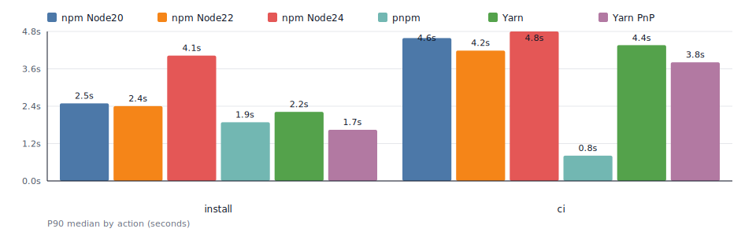

# npm/yarn/pnpm install benchmark

This repository benchmarks install/ci-equivalent performance for npm, pnpm, and Yarn (node-modules and PnP).

<!-- BENCH:START -->

| action | cache | lockfile | node_modules | npm(Node20 10.8.2) | npm(Node22 10.9.4) | npm(Node24 11.6.2) | pnpm(10.28.2) | Yarn(4.12.0) | Yarn PnP(4.12.0) |
| --- | --- | --- | --- | --- | --- | --- | --- | --- | --- |
| install | ✓ | ✓ | ✓ | 1.0s | 0.8s | 0.8s | 0.6s | 0.9s | 0.8s |
| install | ✓ | ✓ |  | 3.6s | 3.2s | 3.9s | 1.0s | 2.4s | 1.5s |
| install | ✓ |  | ✓ | 1.0s | 0.8s | 1.1s | 1.2s | 1.9s | 1.8s |
| install | ✓ |  |  | 6.5s | 5.4s | 6.0s | 2.8s | 3.4s | 2.5s |
| install |  | ✓ | ✓ | 1.4s | 1.2s | 1.2s | 0.5s | 0.9s | 0.8s |
| install |  | ✓ |  | 5.5s | 4.6s | 5.3s | 2.4s | 2.4s | 1.4s |
| install |  |  | ✓ | 1.0s | 0.8s | 3.8s | 3.0s | 1.8s | 1.8s |
| install |  |  |  | 16.8s | 14.3s | 16.4s | 3.9s | 3.4s | 2.5s |
| ci | ✓ | ✓ | ✓ | 3.8s | 3.4s | 4.0s | 0.6s | 3.5s | 3.4s |
| ci | ✓ | ✓ |  | 3.5s | 3.1s | 3.8s | 1.0s | 5.0s | 4.1s |
| ci |  | ✓ | ✓ | 5.6s | 4.8s | 5.4s | 0.6s | 3.4s | 3.4s |
| ci |  | ✓ |  | 5.4s | 4.5s | 5.2s | 2.4s | 5.0s | 4.0s |
<!-- BENCH:END -->

Results are populated automatically by GitHub Actions using P90 (seconds).
